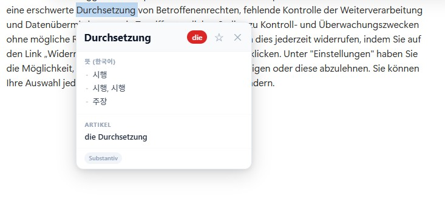
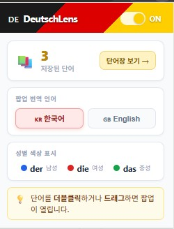
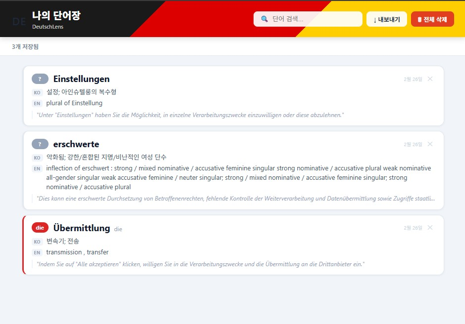

# DeutschLens

> **Learn German gender naturally — just by reading the web.**
> 독일어 명사 성별 시각화 및 스마트 단어장 Chrome 확장 프로그램

<br>

## Overview

독일어 학습의 가장 큰 장벽 중 하나는 **명사의 성별(der / die / das)** 입니다.
DeutschLens는 웹 페이지를 읽는 것만으로도 성별이 자연스럽게 눈에 들어오도록 돕고,
읽기 흐름을 방해하지 않는 1-클릭 팝업으로 사전을 대체합니다.

<br>

## Features

### 🎨 Noun Gender Visualizer


웹 페이지의 독일어 명사를 실시간으로 감지하여 성별에 따라 색상으로 구분합니다.

| 성별 | 관사 | 색상 |
|------|------|------|
| 남성 | **der** | 🔵 파란색 밑줄 |
| 여성 | **die** | 🔴 빨간색 밑줄 |
| 중성 | **das** | 🟢 초록색 밑줄 |

- 약 400개 이상의 핵심 명사를 내장 사전으로 **오프라인 즉시 처리**
- 관사 패턴(`der/die/das + 명사`) 자동 감지
- MutationObserver를 이용해 동적으로 로드되는 콘텐츠(SPA, 뉴스피드)에도 적용
- On / Off 토글로 방해받지 않고 원하는 순간에만 활성화

---

### 💬 Smart Info Popup


단어를 **더블클릭**하거나 **드래그**하면 읽기 흐름을 방해하지 않는 미니 팝업이 열립니다.

- **뜻**: 한국어 / 영어 번역 (툴바에서 언어 전환 가능)
- **명사**: 관사(der/die/das) + 복수형(Plural) + 소유격(Genitiv)
- **동사**: 3인칭 단수 현재형 · Präteritum · Partizip II

데이터 소스:
- [English Wiktionary REST API](https://en.wiktionary.org/api/rest_v1/) — 영어 정의 + 문법 정보
- [MyMemory API](https://mymemory.translated.net/) — 한국어 번역

---

### 🔖 Context-Based Quick Save


팝업의 **☆ 버튼** 하나로 단어를 나만의 단어장에 저장합니다.

독일어는 전치사 격지배(Kasus)가 중요하기 때문에,
단어만 저장하는 것이 아니라 **단어가 등장한 문장 전체**를 함께 저장합니다.

저장 데이터: `단어` · `관사` · `한국어 뜻` · `영어 뜻` · `원문 문맥 문장` · `저장 날짜`

단어장 페이지 기능:
- 단어 카드에 **한국어 / 영어 뜻 동시 표시** (한국어 제공 불가 시 영어만 표시)
- 성별에 따른 카드 좌측 색상 테두리 (der=파랑, die=빨강, das=초록)
- 검색 · 필터링
- CSV 내보내기 (Excel 호환)
- 전체 삭제

<br>

## Tech Stack

| 영역 | 기술 |
|------|------|
| Extension | Chrome Extension API (Manifest V3) |
| Language | JavaScript (ES6+), HTML5, CSS3 |
| Storage | `chrome.storage.local` |
| Background | Service Worker (Manifest V3) |
| Dictionary | English Wiktionary REST API |
| Translation | MyMemory Translation API |
| Styling | Vanilla CSS (외부 라이브러리 없음) |

<br>

## Project Structure

```
DeutschLens/
├── manifest.json             # 확장 프로그램 설정 (Manifest V3)
│
├── html/
│   ├── popup.html            # 툴바 팝업 UI
│   └── wordlist.html         # 단어장 전용 페이지
│
├── css/
│   ├── content.css           # 하이라이팅 및 팝업 스타일
│   ├── popup.css             # 툴바 팝업 스타일
│   └── wordlist.css          # 단어장 페이지 스타일
│
├── js/
│   ├── background.js         # Service Worker — API 호출 및 아이콘 관리
│   ├── nounDict.js           # 내장 독일어 명사 사전 (~400개)
│   ├── wiktionary.js         # Content Script 측 API 메시지 중계
│   ├── content.js            # 핵심 로직 — 컬러링 · 팝업 · 단어 저장
│   ├── popup.js              # On/Off 토글 · 번역 언어 설정
│   └── wordlist.js           # 단어장 페이지 로직
│
└── icons/
    ├── icon16.png            # 툴바 아이콘 (독일 국기, 16×16)
    ├── icon48.png            # 확장 프로그램 관리 페이지 아이콘 (48×48)
    ├── icon128.png           # Chrome Web Store 아이콘 (128×128)
    └── create_icons.html     # 아이콘 재생성 도구
```

<br>

## Installation

Chrome Web Store 배포 전 단계로, 개발자 모드로 직접 설치합니다.

**1. 저장소 클론**
```bash
git clone https://github.com/MinjuKwak01/DeutschLens.git
```

**2. Chrome 확장 프로그램 페이지 열기**
```
chrome://extensions
```

**3. 개발자 모드 활성화**
페이지 우측 상단의 **"개발자 모드"** 토글을 켭니다.

**4. 확장 프로그램 로드**
**"압축해제된 확장 프로그램을 로드합니다"** 버튼을 클릭하고,
클론한 `DeutschLens/` 폴더를 선택합니다.

> 아이콘 파일(`icons/icon*.png`)은 저장소에 포함되어 있으므로 별도 생성이 필요 없습니다.
> 아이콘을 재생성하려면 `icons/create_icons.html`을 브라우저에서 열어 사용하세요.

<br>

## Usage

### 기본 사용 흐름

```
1. 툴바의 DeutschLens 아이콘 클릭 → ON 상태 확인
2. DW News, Spiegel, Wikipedia 등 독일어 페이지 방문
3. 명사에 색상 밑줄이 자동으로 표시됨
4. 모르는 단어를 더블클릭 또는 드래그 → 팝업 확인
5. 팝업의 ☆ 버튼으로 단어장에 저장 (한국어 + 영어 뜻 함께 저장)
```

### 번역 언어 전환

툴바 팝업에서 **🇰🇷 한국어 / 🇬🇧 English** 버튼으로 팝업의 번역 언어를 전환합니다.
설정은 자동 저장되어 다음 세션에서도 유지됩니다.

### 단어장 확인

툴바 팝업의 **"단어장 보기 →"** 버튼을 클릭하거나,
주소창에 다음을 입력합니다:

```
chrome-extension://<extension-id>/html/wordlist.html
```


<br>

## Known Limitations

- 한국어 번역은 [MyMemory API](https://mymemory.translated.net/) 기반으로,
  무료 플랜은 IP당 하루 약 **1,000건** 한도가 있습니다.
  한도 초과 시 팝업에 `번역 실패 · 영어로 표시` 안내가 뜨며, 단어장에는 영어 뜻만 저장됩니다..

- 명사 성별 감지는 내장 사전 기반이므로, 사전에 없는 단어는 팝업을 통해 확인하세요.

<br>

## Contributing

Issues와 Pull Requests 환영합니다.
새 단어를 `js/nounDict.js`에 추가하거나 번역 API를 개선하는 기여도 좋습니다.

<br>

## License

[MIT](LICENSE)

---

<p align="center">
  Made for German learners who hate looking up dictionaries.<br>
  <i>Viel Erfolg beim Deutschlernen! 🇩🇪</i>
</p>
"# DeutschLens" 
